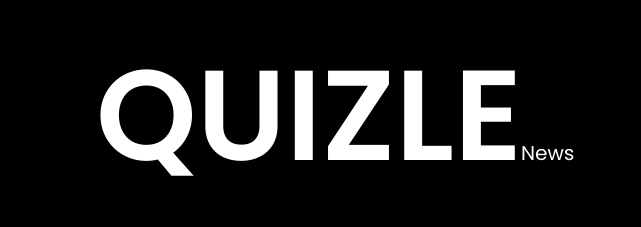

<a name="readme-top"></a>

<!-- PROJECT LOGO -->
<br />
<div align="center">
  <a href="https://github.com/nivab/quizle">
    
  </a>

  <h3 align="center">Quizle </h3>

  <p align="center">
    A website to generate news quizzes for you using AI! 
    <br />
    <!-- <a href="https://github.com/othneildrew/Best-README-Template"><strong>Explore the docs »</strong></a> -->
    <br />
    <br />
    <!-- <a href="https://github.com/othneildrew/Best-README-Template">View Demo</a> -->
    <!-- · -->
    <a href="https://github.com/nIvab/ausquiz/issues">Report Bug</a>
    ·
    <a href="https://github.com/nIvab/ausquiz/issues">Request Feature</a>
  </p>
</div>

<!-- TABLE OF CONTENTS -->
<details>
  <summary>Table of Contents</summary>
  <ol>
    <li>
      <a href="#about-the-project">About The Project</a>
      <ul>
        <li><a href="#built-with">Built With</a></li>
      </ul>
    </li>
    <li>
      <a href="#getting-started">Getting Started</a>
      <ul>
        <li><a href="#prerequisites">Prerequisites</a></li>
        <li><a href="#installation">Installation</a></li>
      </ul>
    </li>
    <li><a href="#usage">Usage</a></li>
    <li><a href="#roadmap">Roadmap</a></li>
    <li><a href="#contributing">Contributing</a></li>
    <li><a href="#license">License</a></li>
    <li><a href="#contact">Contact</a></li>
    <li><a href="#acknowledgments">Acknowledgments</a></li>
  </ol>
</details>

<!-- ABOUT THE PROJECT -->

## About The Project

Quizle is a site that automates the generation of weekly news quizzes (à la the [abc news quiz](https://www.abc.net.au/news/quizzes) or similar).

<p align="right">(<a href="#readme-top">back to top</a>)</p>

### Built With

- [Qwik + QwikCity](https://qwik.builder.io/)
- [TailwindCSS](https://tailwindcss.com/)
- [OpenAI API](https://openai.com/blog/openai-api)
- [World-News API](https://worldnewsapi.com/)

<p align="right">(<a href="#readme-top">back to top</a>)</p>

<!-- GETTING STARTED -->

## Getting Started

This is an example of how you may give instructions on setting up your project locally.
To get a local copy up and running follow these simple example steps.

### Prerequisites

- Take a read through some of the documentation in `/docs`, this contains design and architecture decisions, notes on deployment and the README from the standard Qwik template
- Node: v16.8 or higher
- API keys for World-News and OpenAI API's if you wish to generate quizzes instead of fetching them from some other source(coming soon`)
  - [OpenAI API](https://openai.com/blog/openai-api)
  - [World-News API](https://worldnewsapi.com/)
- Access to a mongodb instance and its connection URI

### Installation

1. Clone the repo
   ```sh
   git clone git@github.com:nIvab/quizle.git
   ```
2. Install NPM packages
   ```sh
   cd quizle
   npm install
   ```
3. Create a `.env` file within the root of the cloned repository and enter your API keys in `.env`

   ```bash
    VITE_NEWS_API_KEY="API key for NewAPI"
    VITE_OPENAI_API_KEY="API key for openAI API"
    VITE_MONGO_CONNECTION_URI="Connection URI for MongoDB instance"
    VITE_ENDPOINT_KEY="Secret key for quiz generation"
   ```

4. To run a development server

   ```bash
   npm run dev
   ```

5. To build the project
   ```bash
   npm run build
   ```

<p align="right">(<a href="#readme-top">back to top</a>)</p>

<!-- CONTRIBUTING -->

## Contributing

Contributions are what make the open source community such an amazing place to learn, inspire, and create. Any contributions you make are **greatly appreciated**.

If you have a suggestion that would make this better, please fork the repo and create a pull request. You can also simply open an issue with the tag "enhancement".
Don't forget to give the project a star! Thanks again!

1. Clone the Project
2. Inspect the [issues](https://github.com/nIvab/quizle/issues) and pick one to work on/open one
3. Create your Feature Branch by clicking "Create a branch" when viewing the particular issue page
4. Fetch your newly created branch (`git fetch origin`)
5. Checkout your branch (`git checkout <issue number>-issue name`)
6. Commit your Changes (`git commit -m 'Add some AmazingFeature'`)
7. Push to the Branch (`git push origin feature/AmazingFeature`)
8. Open a Pull Request

<p align="right">(<a href="#readme-top">back to top</a>)</p>

<!-- LICENSE -->

## License

Distributed under the MIT License. See `LICENSE.txt` for more information.

<p align="right">(<a href="#readme-top">back to top</a>)</p>

<!-- CONTACT -->

## Contact

Ivan Bolderoff - ivanbolderoff@gmail.com

Project Link: [https://github.com/nIvab/ausquiz](https://github.com/nIvab/ausquiz)

<p align="right">(<a href="#readme-top">back to top</a>)</p>

<!-- ACKNOWLEDGMENTS -->

## Acknowledgments

Use this space to list resources you find helpful and would like to give credit to. I've included a few of my favorites to kick things off!

- [Best README Template](https://github.com/othneildrew/Best-README-Template/blob/master/README.md)

<p align="right">(<a href="#readme-top">back to top</a>)</p>

<!-- MARKDOWN LINKS & IMAGES -->
<!-- https://www.markdownguide.org/basic-syntax/#reference-style-links -->

[qwik-url]: https://qwik.builder.io/
[qwik-shield]: https://img.shields.io/github/license/othneildrew/Best-README-Template.svg?style=for-the-badge
[tailwind-url]: https://tailwindcss.com/
[openai-url]: https://openai.com/blog/openai-api
[world-news-url]: https://worldnewsapi.com/
[contributors-shield]: https://img.shields.io/github/contributors/othneildrew/Best-README-Template.svg?style=for-the-badge
[contributors-url]: https://github.com/othneildrew/Best-README-Template/graphs/contributors
[forks-shield]: https://img.shields.io/github/forks/othneildrew/Best-README-Template.svg?style=for-the-badge
[forks-url]: https://github.com/othneildrew/Best-README-Template/network/members
[stars-shield]: https://img.shields.io/github/stars/othneildrew/Best-README-Template.svg?style=for-the-badge
[stars-url]: https://github.com/othneildrew/Best-README-Template/stargazers
[issues-shield]: https://img.shields.io/github/issues/othneildrew/Best-README-Template.svg?style=for-the-badge
[issues-url]: https://github.com/othneildrew/Best-README-Template/issues
[license-shield]: https://img.shields.io/github/license/othneildrew/Best-README-Template.svg?style=for-the-badge
[license-url]: https://github.com/othneildrew/Best-README-Template/blob/master/LICENSE.txt
[linkedin-shield]: https://img.shields.io/badge/-LinkedIn-black.svg?style=for-the-badge&logo=linkedin&colorB=555
[linkedin-url]: https://linkedin.com/in/othneildrew
[product-screenshot]: images/screenshot.png
